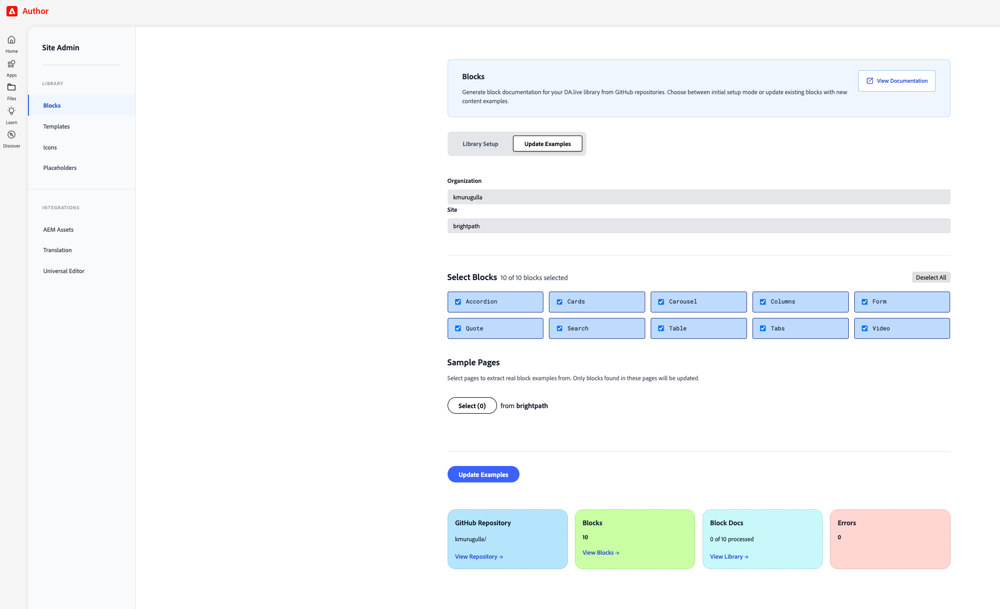

# Site Admin Tool

Comprehensive administration console for managing DA.live sites - library setup, integrations, and site configuration.

## Overview

The Blocks view (Library Setup vs Update Examples) with block selection and sample pages:



## Features

### Library Management
- **Blocks** - Discover, document, and manage block components
- **Templates** - Create and manage page templates
- **Icons** - Manage SVG icons for your site
- **Placeholders** - Define reusable text placeholders/tokens

### Integrations
- **AEM Assets** - Connect AEM as a Cloud Service assets repository
- **Translation** - Configure translation services and behavior
- **Universal Editor** - Set up WYSIWYG content authoring

## Installation

### Option 1: Use the shared app (recommended)

No code to pull. Any site can use the tool by adding one app row to its config; the app is served from this project.

1. Open your site config: `https://da.live/config#/{org}/{site}/`
2. Open or create the **apps** sheet.
3. Add a row with:

| Column | Value |
|--------|-------|
| **title** | `Site Admin` |
| **description** | `Visual interface for configuring site` |
| **image** | `https://main--brightpath--kmurugulla.aem.live/tools/admin/siteadmin.jpg` |
| **path** | `https://da.live/app/kmurugulla/brightpath/tools/admin/siteadmin?org=YOUR_ORG&site=YOUR_SITE` |

4. Replace `YOUR_ORG` and `YOUR_SITE` with your organization and site (e.g. `myorg`, `mysite`).
5. Save the config.

The app will show up on your Apps page at `https://da.live/apps#/{org}/{site}`. No clone or deploy needed.

### Option 2: Pull the code

Use this if you want to run or customize the tool in your own repo.

From your project root:

```bash
npx degit kmurugulla/brightpath/tools/admin tools/admin
```

Or with curl:

```bash
curl -L https://github.com/kmurugulla/brightpath/archive/refs/heads/main.tar.gz | \
  tar -xz --strip=3 "brightpath-main/tools/admin" && mv admin tools/
```

Then register it in your site config: set **path** to `https://da.live/app/{org}/{site}/tools/admin/siteadmin`, and use **ref** `local` (development) or leave empty (production after you deploy).

For more on DA.live apps, see the [official documentation](https://docs.da.live/developers/guides/developing-apps-and-plugins).

## Getting Started

### Access the Tool

**If you used Option 1 (shared app):** Open `https://da.live/apps#/{org}/{site}` and click the Site Admin card.

**If you pulled the code (Option 2):** Run your local development server:
```bash
aem up
```

Then access the admin tool via:
```
https://da.live/app/{org}/{site}/tools/admin/siteadmin?ref=local
```

Replace `{org}` and `{site}` with your DA.live organization and site names.

**Query parameters (Option 2 only):**
- `ref=local` – use your local dev server (port 3000)
- `ref=main` – use production after deploy

After registering the app in your site config, you can also open it from the Apps page: `https://da.live/apps#/{org}/{site}`.

## Usage Guide

### Library Setup - Initial Mode

Create a new block library from scratch or add blocks to an existing library:

**Steps:**
1. **Enter GitHub Repository URL** - Provide the URL to your GitHub repository containing blocks
   - Public repositories work immediately
   - Private repositories require a GitHub token (will be prompted)
   - Token can be saved securely for future use

2. **Block Discovery** - Automatically discovers all blocks in your repository
   - Searches for blocks at any level (supports nested structures)
   - Detects new blocks not yet in your library (marked with "New" badge)
   - Use "Select New Only" to quickly add just new blocks
   - Use "Select All" / "Deselect All" for bulk operations

3. **Block Analysis** - Each block is analyzed for:
   - Structure and variants
   - CSS classes and features
   - Required vs. optional content
   - Intelligent placeholder documentation generated

4. **Sample Pages (Optional)** - Select pages to extract real content examples
   - Browse your DA.live content via page picker
   - Extract actual block usage from live pages
   - Enriches documentation with real examples

5. **Create Library** - Click "Set Up Library" to:
   - Generate block documentation
   - Create/update `blocks.json` configuration
   - Register library in site configuration
   - Automatically version existing docs before overwriting

### Library Setup - Update Examples Mode

Update existing block documentation with new content examples:

**Steps:**
1. **Switch to "Update Examples" mode** using the toggle
2. **Enter Organization and Site** - Your existing DA.live site details
3. **Select Blocks** - Choose which blocks to refresh
4. **Add Sample Pages** - Select pages containing updated block examples
5. **Update** - Click "Update Examples" to:
   - Create version snapshots of existing docs
   - Extract content from selected pages
   - Update only the blocks found in those pages
   - Preserve all other existing blocks

### Managing Templates

**Add Templates:**
1. Navigate to "Templates" tab
2. Enter template name (e.g., "Blog Post")
3. Click "Select Page" to choose a source page
4. Click "+ Add" to add to the list
5. Click "Set Up Library" to save

**Edit/Remove:**
- Use "Edit" button on existing templates to modify
- Use "Remove" button to delete from library

### Managing Icons

**Add Icons:**
1. Navigate to "Icons" tab
2. Enter icon name (e.g., "search", "menu")
3. Click "Select Page" to choose an SVG file
4. Click "+ Add" to add to the list
5. Click "Set Up Library" to save

**SVG Requirements:**
- Must be valid SVG format
- Recommended size: 24x24px
- Clean, optimized paths

### Managing Placeholders

**Add Placeholders:**
1. Navigate to "Placeholders" tab
2. Enter a key (e.g., "copyright")
3. Enter a value (e.g., "© 2024 Company Name")
4. Click "+ Add"
5. Click "Set Up Library" to save

**Use Cases:**
- Legal disclaimers
- Copyright notices
- Repeated text snippets
- Dynamic content tokens

### Integration Setup

#### AEM Assets Integration

Connect your AEM as a Cloud Service assets repository:

1. Navigate to "AEM Assets" tab
2. Enter **Repository ID** - Your AEM repository hostname (without `https://`)
   - Format: `author-pxxxx-eyyyy.adobeaemcloud.com` for author
   - Format: `delivery-pxxxx-eyyyy.adobeaemcloud.com` for Dynamic Media delivery
   - Validation happens automatically when you leave the field
3. Enter **Production Origin** (Optional) - Your production domain (full URL)
   - Format: `https://mysite.com`
   - Used to load assets from your custom domain
   - Validation happens automatically when you leave the field
4. Select desired options:
   - **Insert links instead of copying images** - Reference assets via URL
   - **Allow selecting asset renditions** - Let authors choose specific sizes
   - **Use Dynamic Media delivery** - Enable Dynamic Media for advanced features
   - **Enable Smart Crop selection** - Use AI-powered smart cropping
5. Click "Save Configuration"

**Important Notes:**
- URLs are automatically validated when you leave each field
- Repository IDs must be **hostnames only** (no `https://`), e.g., `author-pxxxx-eyyyy.adobeaemcloud.com`
- Production Origin requires the **full URL** with `https://`, e.g., `https://mysite.com`
- DA.live automatically adds the `Key` and `Value` column headers when rendering the data sheet
- Existing configuration is preserved - you'll see an info banner when editing an existing integration
- All AEM-related settings are stored in the `data` sheet of your site's `config.json`
- There can only be one AEM Assets integration per site (duplicate keys are automatically replaced)

#### Translation Configuration

Configure how translation services handle content:

1. Navigate to "Translation" tab
2. Configure settings:
   - **Translate Behavior** - How to handle existing content (overwrite/skip)
   - **Translate Staging** - Enable/disable staging
   - **Rollout Behavior** - How to handle rollout (overwrite/skip)
3. Click "Save Configuration"

#### Universal Editor Setup

Enable WYSIWYG content authoring:

1. Navigate to "Universal Editor" tab
2. Enter **Editor Path** - Path to your Universal Editor configuration
3. Click "Save Configuration"

## Architecture

### File Structure
```
tools/admin/
├── app/
│   ├── handlers/          # Event handlers
│   ├── main.js            # Main application logic
│   ├── router.js          # Client-side routing
│   ├── state.js           # Application state
│   └── templates.js       # HTML templates
├── operations/            # Business logic
├── utils/                 # Utility functions
├── styles/                # CSS files
│   ├── admin.css          # Core styles (base, layout, nav)
│   ├── blocks-section.css
│   ├── library-items-section.css
│   ├── integrations.css
│   ├── progress.css
│   ├── error-modal.css
│   ├── page-picker.css
│   └── github-section.css
├── config.js              # Configuration constants
├── siteadmin.html         # Entry point
└── README.md
```

### Key Components

- **Handlers** - Factory pattern for library items (templates, icons, placeholders)
- **Operations** - GitHub API, DA.live API, library operations
- **Utils** - Block analysis, content extraction, document generation
- **State Management** - Centralized application state
- **Router** - Hash-based client-side routing

## Requirements

### Access
- Must be run from within DA.live for authentication
- Write access to CONFIG for your organization
  - [See permissions guide](https://docs.da.live/administrators/guides/permissions)

### GitHub Integration
- GitHub token needed **only** for private repositories
- Token can be saved securely in browser for future use
- Public repositories work without authentication

### Optional
- Sample pages for extracting real content examples
- Tool generates intelligent placeholders without them

## Troubleshooting

### Authentication Issues
- **Problem**: "DA.live authentication required"
- **Solution**: Ensure you're accessing the tool from within DA.live, not directly via localhost

### GitHub Rate Limiting
- **Problem**: "GitHub API rate limit exceeded"
- **Solution**: Add a GitHub token (increases rate limit from 60 to 5000 requests/hour)

### Library Not Found
- **Problem**: "No library found at this location"
- **Solution**: Run "Library Setup" first in setup mode to create the library structure

### Permission Errors
- **Problem**: "Unable to update site configuration"
- **Solution**: Ensure you have CONFIG write permissions for your organization

## Development

### Making Changes

The tool is designed to be customized for your project:

1. Edit files in `tools/admin/`
2. Changes are reflected immediately with `ref=local`
3. Test thoroughly before committing
4. Run linting: `npm run lint`

### Code Style

- JavaScript: ES6+ with Airbnb ESLint configuration
- CSS: Modern CSS with nesting, custom properties
- No build step required - vanilla JavaScript

### Contributing

When modifying the tool:
1. Follow existing code patterns
2. Use the handler factory for new library item types
3. Maintain CSS custom properties in `admin.css`
4. Test all views and interactions
5. Ensure linting passes

## Support

For issues or questions:
- Check DA.live documentation: https://docs.da.live
- Review this README
- Check browser console for errors
- Verify permissions and authentication

## License

MIT
