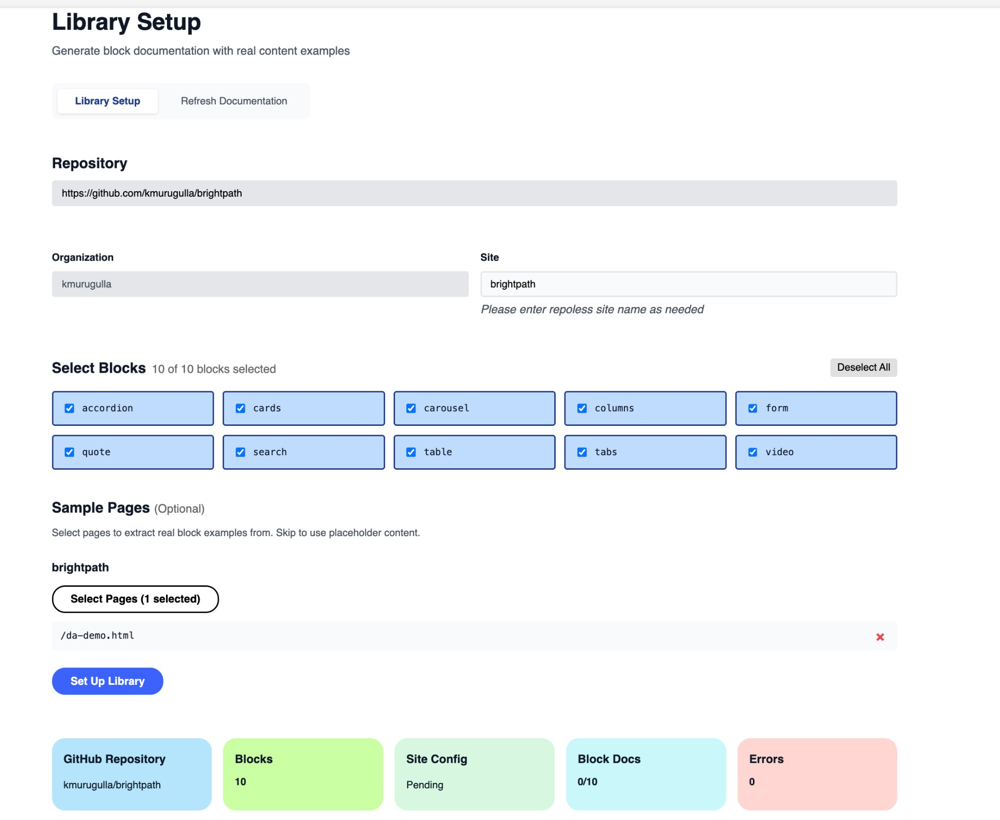
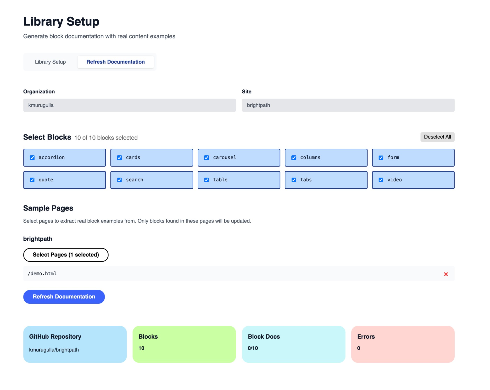

# Library Setup Tool

Generate block documentation for your DA.live library from GitHub repositories.

## Getting Started

- Copy the `library-setup` folder into your project's `tools/` directory
- Access via: `https://da.live/app/{org}/{site}/tools/library-setup/library-setup?ref=local`
- `ref=local` points to your local development server
- Customize the code as needed for your project

## Setup Mode

Use this mode to create a new block library from scratch:

- Enter your GitHub repository URL to discover blocks
- Private repositories supported - enter a GitHub token when prompted
- Select which blocks to include in your library
- Blocks are automatically analyzed for structure, variants, and features
- Placeholder documentation generated based on block code analysis
- Optionally select sample pages to extract real content examples
- Creates library structure in DA.live with blocks.json configuration
- Updates site configuration to register the library

## Refresh Documentation Mode

Use this mode to update existing block documentation with new content:

- No GitHub repository required - reads from existing library
- Enter your DA.live organization and site name
- Select which blocks to update
- Add new sample pages to extract fresh content examples
- Only updates blocks found in the selected pages
- Preserves existing blocks not being updated
- Maintains all library configuration settings

## Requirements

- Must be run from within DA.live for authentication
- Write access to CONFIG for your organization (required to update site configuration)
- GitHub token needed only for private repositories (can be saved for future use)
- Sample pages optional - tool generates intelligent placeholders without them
