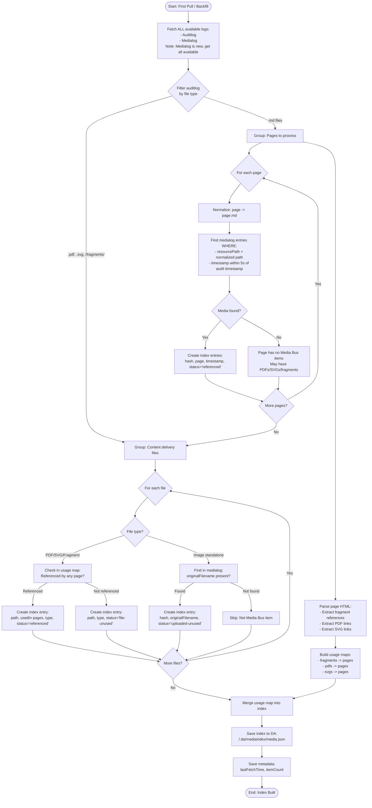
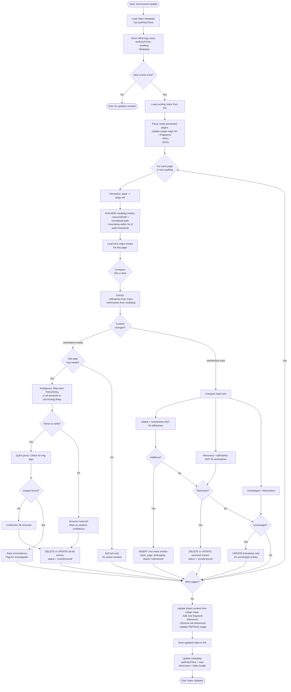
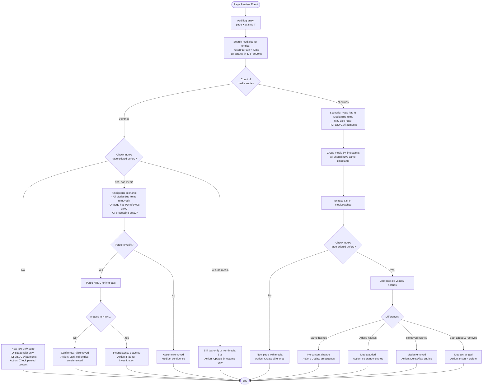
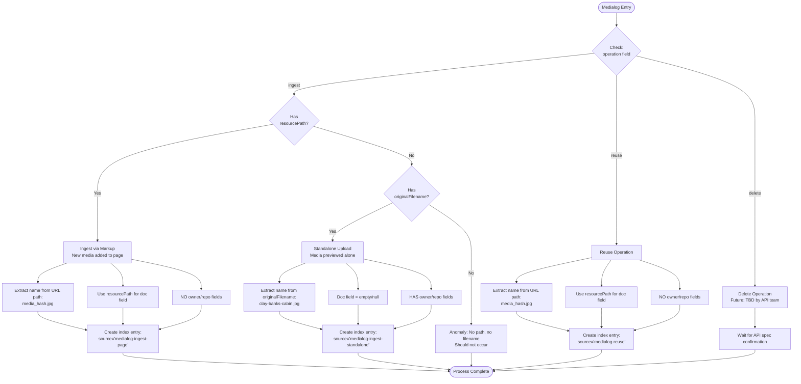

# Media Indexing Strategy for AEM Sites
**Date:** February 24, 2026
**Author:** Testing & Analysis with Claude Code
**Project:** Media Library Integration with Medialog & Auditlog

---

## Summary

Strategy for building a media index by combining **AEM Auditlog** and **Medialog** APIs, including operational architecture for backfilling historical data, initial index population, and ongoing refresh mechanisms.

### Key Findings

- **Two Log Sources:** Auditlog tracks page/file previews; Medialog tracks Media Bus items (images/videos)
- **Temporal Relationship:** Auditlog entries precede medialog by 1.5-2 seconds
- **Path Matching:** Critical to normalize paths (`/drafts/page` vs `/drafts/page.md`)
- **Media Bus vs Content Delivery:** Images/videos use Media Bus (tracked in medialog), PDFs/SVGs/Fragments use content delivery (auditlog only)
- **Parsing Required:** Fragments, PDFs, and SVGs require parsing page content to determine usage relationships
- **Duplicate Events:** Every preview creates new log entries, even without content changes
- **Time Window:** Use 5-second window to match medialog entries to auditlog events

### Operational Architecture

- **Two-Tier Backfill:** Separate CLI tool for medialog backfill, separate DA app for index population
- **Historical Coverage:** Supports sites created before medialog existed (2023+) via Status API parsing
- **Initial Setup:** One-time engineer-run process per repository (30-60 minutes total)
- **Ongoing Refresh:** Browser-based auto-refresh every 10 minutes with distributed locking
- **Multi-User Support:** Distributed lock prevents race conditions across concurrent users
- **Scalability:** Handles sites with 10,000+ pages and 50,000+ media items

---

## Log Relationships

### Auditlog vs Medialog

| Aspect | Auditlog | Medialog |
|--------|----------|----------|
| **Purpose** | Tracks all preview/publish actions | Tracks Media Bus activity only |
| **Scope** | Pages, PDFs, SVGs, Fragments, images, videos | Images and videos only |
| **Timing** | Logged first (T) | Logged ~1.5-2s later (T+1500ms) |
| **Path Format** | `/drafts/page` | `/drafts/page.md` |
| **Contains** | Page-level events | Media-level events with `resourcePath` |

### Linking Strategy

```
Auditlog Entry                    Medialog Entries
┌─────────────────────┐          ┌──────────────────────────┐
│ path: /drafts/page  │  ───────>│ resourcePath: /drafts/   │
│ timestamp: 1000     │  match   │   page.md                │
│                     │  by:     │ timestamp: 1001-1005     │
└─────────────────────┘          └──────────────────────────┘
                                           │
                                           │ Multiple media
                                           ▼
                                  All have same timestamp
```

**Matching Rules:**
1. Normalize paths: `auditlog.path` + `.md` = `medialog.resourcePath`
2. Time window: `medialog.timestamp` within 5 seconds after `auditlog.timestamp`
3. Group medialog entries by `(resourcePath, timestamp)` to find page's media

---

## Content Types & Tracking Methods

### Complete Matrix

| Content Type | Delivery Method | Auditlog | Medialog | Tracking Method | Usage Relationship |
|-------------|-----------------|----------|----------|-----------------|-------------------|
| **Images (embedded)** | Media Bus | Page event | Entry with resourcePath | Medialog linking | From resourcePath field |
| **Images (standalone)** | Media Bus | File event | Entry with originalFilename | Medialog linking | No usage (standalone) |
| **Videos (embedded)** | Media Bus | Page event | Entry with resourcePath | Medialog linking | From resourcePath field |
| **Videos (standalone)** | Media Bus | File event | Entry with originalFilename | Medialog linking | No usage (standalone) |
| **PDFs** | Content delivery | File event | None | Auditlog + Parse | Parse page HTML for links |
| **SVGs** | Content delivery | File event | None | Auditlog + Parse | Parse page HTML for links |
| **Fragments** | Content delivery | File event | None | Auditlog + Parse | Parse page HTML for references |
| **Icons** | Icons folder | None | None | Not tracked | N/A |

### Why Different Tracking Methods?

**Media Bus Items (Images, Videos):**
- Deduplicated, content-addressed storage
- Hash-based URLs: `media_<hash>/<filename>`
- Tracked in medialog with `resourcePath` linking to pages
- **No parsing required** - logs provide complete relationships

**Content Delivery Items (PDFs, SVGs, Fragments):**
- Regular file delivery
- Standard preview/publish lifecycle
- Not content-addressed
- **Parsing required** - logs don't link to containing pages

**Source:** [AEM Media Documentation](https://www.aem.live/docs/media)

---

## Test Scenarios & Results

### Scenario A: Page with 3 Images

**Action:** Created `/drafts/scenario-a.md` with 3 embedded images, previewed once

**Auditlog Response:**
```json
{
  "entries": [
    {
      "path": "/drafts/scenario-a",
      "timestamp": 1771936397105,
      "route": "preview",
      "user": "user@example.com",
      "status": 200
    }
  ]
}
```

**Medialog Response:**
```json
{
  "entries": [
    {
      "path": "https://main--repo--org.aem.live/media_a1b2c3/image1.jpg",
      "operation": "ingest",
      "timestamp": 1771936400523,
      "resourcePath": "/drafts/scenario-a.md",
      "contentType": "image/jpeg",
      "user": "user@example.com",
      "mediaHash": "a1b2c3",
      "width": "2000",
      "height": "1333"
    },
    {
      "path": "https://main--repo--org.aem.live/media_d4e5f6/image2.jpg",
      "operation": "ingest",
      "timestamp": 1771936400523,
      "resourcePath": "/drafts/scenario-a.md",
      "contentType": "image/jpeg",
      "user": "user@example.com",
      "mediaHash": "d4e5f6",
      "width": "2000",
      "height": "1500"
    },
    {
      "path": "https://main--repo--org.aem.live/media_g7h8i9/image3.jpg",
      "operation": "ingest",
      "timestamp": 1771936400523,
      "resourcePath": "/drafts/scenario-a.md",
      "contentType": "image/jpeg",
      "user": "user@example.com",
      "mediaHash": "g7h8i9",
      "width": "2000",
      "height": "1600"
    }
  ]
}
```

**Learning:**
- All media on same page share identical timestamp
- Media added through markup: `operation: "ingest"` WITHOUT `originalFilename`
- 3.4 second processing delay between logs
- `resourcePath` links media to page

---

### Scenario B: Text-Only Page

**Action:** Created `/drafts/scenario-b.md` with only text, previewed

**Auditlog Response:**
```json
{
  "entries": [
    {
      "path": "/drafts/scenario-b",
      "timestamp": 1771936758410,
      "route": "preview",
      "user": "user@example.com",
      "duration": 1112,
      "status": 200
    }
  ]
}
```

**Medialog Response:**
```json
{
  "entries": []
}
```

**Learning:**
- Auditlog logs text-only pages
- Empty medialog = no Media Bus items on page
- Can detect "all media removed" pattern (with caveats)

---

### Scenario H: Standalone Media Preview

**Action:** Uploaded and previewed 3 standalone files:
- `/media/standalone-image.jpg` (image)
- `/media/standalone-doc.pdf` (PDF)
- `/media/standalone-graphic.svg` (SVG)

**Auditlog Response:**
```json
{
  "entries": [
    {
      "path": "/media/standalone-image.jpg",
      "timestamp": 1771937123456,
      "route": "preview",
      "user": "user@example.com",
      "status": 200
    },
    {
      "path": "/media/standalone-doc.pdf",
      "timestamp": 1771937125789,
      "route": "preview",
      "user": "user@example.com",
      "status": 200
    },
    {
      "path": "/media/standalone-graphic.svg",
      "timestamp": 1771937128012,
      "route": "preview",
      "user": "user@example.com",
      "status": 200
    }
  ]
}
```

**Medialog Response:**
```json
{
  "entries": [
    {
      "path": "https://main--repo--org.aem.live/media_j1k2l3/standalone-image.jpg",
      "operation": "ingest",
      "timestamp": 1771937124567,
      "originalFilename": "/media/standalone-image.jpg",
      "contentType": "image/jpeg",
      "user": "user@example.com",
      "mediaHash": "j1k2l3",
      "owner": "2d0fcd52abc",
      "repo": "2d0fcd52abc",
      "width": "1920",
      "height": "1080"
    }
  ]
}
```

**Learning:**
- Images: Appear in BOTH logs
- PDFs/SVGs: Auditlog ONLY (not on Media Bus)
- Standalone uploads have `originalFilename` + `owner` + `repo`
- NO `resourcePath` (not linked to page)

---

### Scenario G: Page with Mixed Media

**Action:** Created `/drafts/scenario-g.md` with:
- 2 embedded images
- 1 PDF preview link
- 1 SVG preview link
- 1 icon (`:headset:`)

**Auditlog Response (page preview):**
```json
{
  "entries": [
    {
      "path": "/drafts/scenario-g",
      "timestamp": 1771937500000,
      "route": "preview",
      "user": "user@example.com",
      "status": 200
    }
  ]
}
```

**Auditlog Response (when user clicks PDF/SVG links):**
```json
{
  "entries": [
    {
      "path": "/media/standalone-doc.pdf",
      "timestamp": 1771937510000,
      "route": "preview",
      "user": "user@example.com",
      "status": 200
    },
    {
      "path": "/media/standalone-graphic.svg",
      "timestamp": 1771937515000,
      "route": "preview",
      "user": "user@example.com",
      "status": 200
    }
  ]
}
```

**Medialog Response:**
```json
{
  "entries": [
    {
      "path": "https://main--repo--org.aem.live/media_m4n5o6/image1.jpg",
      "operation": "ingest",
      "timestamp": 1771937501500,
      "resourcePath": "/drafts/scenario-g.md",
      "contentType": "image/jpeg",
      "user": "user@example.com",
      "mediaHash": "m4n5o6",
      "width": "1800",
      "height": "1200"
    },
    {
      "path": "https://main--repo--org.aem.live/media_p7q8r9/image2.jpg",
      "operation": "ingest",
      "timestamp": 1771937501500,
      "resourcePath": "/drafts/scenario-g.md",
      "contentType": "image/jpeg",
      "user": "user@example.com",
      "mediaHash": "p7q8r9",
      "width": "2000",
      "height": "1500"
    }
  ]
}
```

**Learning:**
- Only embedded images tracked in medialog
- Icons: Not tracked
- PDF/SVG links: Create separate auditlog entries when clicked (unrelated timestamps)
- **Cannot determine page→PDF/SVG relationships from logs**
- **Parsing required** to find which pages reference PDFs/SVGs/Fragments

---

### Re-Preview Test: Duplicate Events

**Action:** Re-previewed scenario-a, scenario-b, scenario-g without changes

**Auditlog Response:**
```json
{
  "entries": [
    {
      "path": "/drafts/scenario-b",
      "timestamp": 1771938338331,
      "route": "preview",
      "user": "user@example.com",
      "status": 200
    },
    {
      "path": "/drafts/scenario-a",
      "timestamp": 1771938338335,
      "route": "preview",
      "user": "user@example.com",
      "status": 200
    },
    {
      "path": "/drafts/scenario-g",
      "timestamp": 1771938338340,
      "route": "preview",
      "user": "user@example.com",
      "status": 200
    }
  ]
}
```

**Medialog Response:**
```json
{
  "entries": [
    {
      "path": "https://main--repo--org.aem.live/media_m4n5o6/image1.jpg",
      "operation": "reuse",
      "timestamp": 1771938339903,
      "resourcePath": "/drafts/scenario-g.md",
      "contentType": "image/jpeg",
      "user": "user@example.com",
      "mediaHash": "m4n5o6"
    },
    {
      "path": "https://main--repo--org.aem.live/media_p7q8r9/image2.jpg",
      "operation": "reuse",
      "timestamp": 1771938339903,
      "resourcePath": "/drafts/scenario-g.md",
      "contentType": "image/jpeg",
      "user": "user@example.com",
      "mediaHash": "p7q8r9"
    },
    {
      "path": "https://main--repo--org.aem.live/media_a1b2c3/image1.jpg",
      "operation": "reuse",
      "timestamp": 1771938340350,
      "resourcePath": "/drafts/scenario-a.md",
      "contentType": "image/jpeg",
      "user": "user@example.com",
      "mediaHash": "a1b2c3"
    },
    {
      "path": "https://main--repo--org.aem.live/media_d4e5f6/image2.jpg",
      "operation": "reuse",
      "timestamp": 1771938340350,
      "resourcePath": "/drafts/scenario-a.md",
      "contentType": "image/jpeg",
      "user": "user@example.com",
      "mediaHash": "d4e5f6"
    },
    {
      "path": "https://main--repo--org.aem.live/media_g7h8i9/image3.jpg",
      "operation": "reuse",
      "timestamp": 1771938340350,
      "resourcePath": "/drafts/scenario-a.md",
      "contentType": "image/jpeg",
      "user": "user@example.com",
      "mediaHash": "g7h8i9"
    }
  ]
}
```

**Learning:**
- Every preview creates new events (even without changes)
- `operation: "reuse"` indicates media already exists
- Cannot rely on "new events = new content"
- Must compare current state vs previous state

---

## Parsing Strategy for Linked Content

### Why Parsing is Needed

**Media Bus items** (images/videos) have `resourcePath` in medialog that directly links them to pages. **Content delivery items** (PDFs/SVGs/Fragments) do NOT have this linking - you must parse page HTML to find references.

### Current Implementation

The codebase already parses for fragments:

```javascript
// From media-library.js (existing code)
const [fragmentLogEntries, pageLogEntries] = await Promise.all([
  fetchFragments(this.org, this.repo, 'main', since),
  fetchPages(this.org, this.repo, 'main', since),
]);

// Parse pages to build fragment usage map
const usageMap = await buildFragmentUsageMap(pageLogEntries, this.sitePath);

const mergedData = mergeFragmentEntries(
  fragmentsData,
  fragmentLogEntries,
  this.org,
  this.repo,
  usageMap  // Usage map from parsing
);
```

### Unified Parsing Approach

Extend the existing fragment parsing to include PDFs and SVGs:

```javascript
async function buildContentUsageMap(pageLogEntries, org, repo) {
  const usageMap = {
    fragments: new Map(),  // fragment path -> [page paths]
    pdfs: new Map(),       // pdf path -> [page paths]
    svgs: new Map(),       // svg path -> [page paths]
  };

  for (const pageEvent of pageLogEntries) {
    // Fetch page HTML (single fetch per page)
    const html = await fetchPageHtml(pageEvent.path, org, repo);

    // Extract all content types in one pass
    const fragments = extractFragmentReferences(html);
    const pdfs = extractLinks(html, /\.pdf$/);
    const svgs = extractLinks(html, /\.svg$/);

    // Build usage maps
    fragments.forEach(f => {
      if (!usageMap.fragments.has(f)) {
        usageMap.fragments.set(f, []);
      }
      usageMap.fragments.get(f).push(pageEvent.path);
    });

    pdfs.forEach(p => {
      if (!usageMap.pdfs.has(p)) {
        usageMap.pdfs.set(p, []);
      }
      usageMap.pdfs.get(p).push(pageEvent.path);
    });

    svgs.forEach(s => {
      if (!usageMap.svgs.has(s)) {
        usageMap.svgs.set(s, []);
      }
      usageMap.svgs.get(s).push(pageEvent.path);
    });
  }

  return usageMap;
}
```

### Extraction Helper Functions

```javascript
function extractFragmentReferences(html) {
  // Fragments typically appear in href attributes
  const fragmentPattern = /href="([^"]*\/fragments\/[^"]+)"/g;
  const matches = [...html.matchAll(fragmentPattern)];
  return matches.map(m => m[1]).map(normalizePath);
}

function extractLinks(html, pattern) {
  // Extract href or src attributes matching pattern
  const linkPattern = new RegExp(`(?:href|src)="([^"]*${pattern.source})"`, 'gi');
  const matches = [...html.matchAll(linkPattern)];
  return matches.map(m => m[1]).map(normalizePath);
}

function normalizePath(path) {
  // Remove query params, hashes
  return path.split('?')[0].split('#')[0];
}
```

### Performance Optimization

**Single-pass parsing:**
```javascript
// GOOD: Fetch once, extract all
const html = await fetchPageHtml(page);
const allContent = {
  fragments: extractFragments(html),
  pdfs: extractPdfs(html),
  svgs: extractSvgs(html),
};

// BAD: Multiple fetches
const fragments = extractFragments(await fetchPageHtml(page));
const pdfs = extractPdfs(await fetchPageHtml(page));  // Duplicate fetch!
```

### When to Parse

**Parse frequency:**
- **Initial build:** Parse all pages to establish complete usage map
- **Incremental update:** Parse only pages with new auditlog events
- **Validation:** Periodic full re-parse (weekly/monthly) to catch any drift

---

## Operational Architecture

### Overview

Two-tier approach: historical data backfill (Tier 1) + ongoing incremental updates (Tier 2). Separates concerns, handles large sites efficiently, no server infrastructure for ongoing operations.

### Architecture Diagram

```
Historical Data (2023-2026)          Live Data (2026+)
┌──────────────────────┐            ┌────────────────────┐
│  Status API          │            │  Auditlog API      │
│  (all pages)         │            │  Medialog API      │
└──────────┬───────────┘            └─────────┬──────────┘
           │                                  │
           v                                  v
    ┌──────────────┐                  ┌──────────────┐
    │ Tier 1:      │                  │ Incremental  │
    │ Medialog     │                  │ Refresh      │
    │ Backfill CLI │                  │ (10-min)     │
    └──────┬───────┘                  └──────┬───────┘
           │                                  │
           v                                  │
    ┌──────────────┐                         │
    │ Medialog API │                         │
    │ (populated)  │                         │
    └──────┬───────┘                         │
           │                                  │
           └─────────────┬────────────────────┘
                         v
                  ┌──────────────┐
                  │ Tier 2:      │
                  │ Index        │
                  │ Population   │
                  └──────┬───────┘
                         v
                  ┌──────────────┐
                  │ .da/         │
                  │ mediaindex/  │
                  │ index.json   │
                  └──────────────┘
```

---

### Tier 1: Medialog Backfill (One-Time)

**Purpose:** Populate medialog API with historical data for sites created before medialog existed

**Implementation:** CLI tool at `/media-log-ingestor`

**Process:**
1. Engineer runs CLI tool with org/repo credentials
2. Tool fetches all pages via Status API
3. Parses markdown content to extract media references
4. Sends entries to Medialog API in batches
5. Deduplicates based on media hash (first = ingest, subsequent = reuse)
6. Enriches with user information from preview logs

**Command:**
```bash
logmedia ingest --org myorg --repo myrepo --token <token>
```

**Characteristics:**
- One-time operation per repository
- Takes 5-30 minutes depending on site size
- Handles rate limits (10 req/sec)
- Resumable on failure
- Creates historical medialog entries with "ingest" operations

**Output:**
- Medialog API populated with historical media references
- All pages analyzed, media tracked back to 2023
- Ready for Tier 2 index building

---

### Tier 2: Index Population & Refresh

#### Initial Population (One-Time per Site)

**Purpose:** Build complete media index from medialog + auditlog data

**Implementation:** Separate DA app at `/tools/media-indexer` (to be created)

**Process:**
1. Engineer navigates to `/tools/media-indexer`
2. Clicks "Build Initial Index" button
3. Server-side process:
   - Fetches all medialog entries (from Tier 1 backfill)
   - Fetches all auditlog entries (last 90 days)
   - Processes and combines data
   - Parses pages for PDFs/SVGs/Fragments
   - Deduplicates and sorts
   - Writes to `.da/mediaindex/index.json`
4. Displays progress (X of Y pages processed)
5. Completes in 30-60 seconds

**Characteristics:**
- One-time per repository
- Server-side execution (handles large datasets)
- Shows progress indicator
- Atomic operation (succeeds or fails completely)
- Creates complete index with all historical + recent data

**Output:**
```
.da/mediaindex/
├── index.json           # Complete media index
├── medialog-meta.json   # { lastFetchTime, entriesCount, lastRefreshBy }
└── lock.json            # Distributed lock (initially unlocked)
```

---

#### Incremental Refresh (Ongoing)

**Purpose:** Keep index up-to-date with new preview activity

**Two Modes:**

**1. User-Triggered Refresh**
- User clicks "Refresh" button in media library
- Acquires distributed lock
- Fetches logs since last update (incremental)
- Merges with existing index
- Updates UI immediately
- Takes 2-5 seconds

**2. Background Auto-Refresh**
- Runs every 10 minutes from any open browser
- Checks if lock is available
- Checks if index is stale (> 5 minutes old)
- If both true, performs incremental refresh
- Silent operation, no UI disruption
- Dispatches event for UI refresh when complete

---

### Distributed Locking Strategy

**Problem:** Multiple users may have media library open simultaneously, each browser trying to refresh every 10 minutes. Without coordination, this creates race conditions and corrupts the index.

**Solution:** Distributed lock using `.da/mediaindex/lock.json`

#### Lock Structure

```json
{
  "locked": true,
  "lockedBy": "user@example.com|session-abc123",
  "lockedAt": 1709567890000,
  "operation": "auto-refresh",
  "timeout": 300000
}
```

#### Lock Behavior

**Acquiring Lock:**
```javascript
1. Read current lock.json
2. If locked=false OR (now - lockedAt) > timeout:
   - Write new lock with your identity
   - Wait 500ms
   - Re-read to verify (race condition check)
   - If lockedBy matches yours, lock acquired
   - Else, retry (max 3 attempts with 2s delay)
3. If locked by someone else:
   - Return "lock held by X"
```

**Releasing Lock:**
```javascript
1. Read current lock.json
2. If lockedBy matches your identity:
   - Write { locked: false, releasedAt: now }
3. Else, skip (don't own lock)
```

**Lock Timeout:**
- Default: 5 minutes (300000ms)
- After 5 minutes, lock considered expired
- Next process treats expired lock as unlocked
- Handles browser crashes gracefully

**Priority:**
- User-triggered refresh > Background refresh
- User clicks button: Attempts lock immediately
- Background timer: Checks lock first, skips if held

---

### File Structure & Metadata

#### .da/mediaindex/index.json

Main index file containing processed media entries:

```json
[
  {
    "hash": "abc123",
    "url": "https://main--repo--org.aem.live/media_abc123/image.jpg",
    "name": "image.jpg",
    "page": "/drafts/my-page.md",
    "timestamp": 1709567890000,
    "user": "user@example.com",
    "operation": "ingest",
    "type": "img > jpg",
    "source": "medialog"
  },
  {
    "path": "/media/doc.pdf",
    "usedIn": ["/drafts/page1.md", "/drafts/page2.md"],
    "timestamp": 1709567890000,
    "user": "user@example.com",
    "type": "document > pdf",
    "status": "referenced",
    "source": "auditlog-parsed"
  }
]
```

#### .da/mediaindex/medialog-meta.json

Metadata tracking last refresh:

```json
{
  "lastFetchTime": 1709567890000,
  "entriesCount": 1523,
  "lastRefreshBy": "user@example.com"
}
```

#### .da/mediaindex/lock.json

Distributed lock state:

```json
{
  "locked": false,
  "lockedBy": null,
  "lockedAt": null,
  "operation": null,
  "releasedAt": 1709567890000
}
```

---

### Operational Procedures

#### Initial Setup (One-Time per Repository)

**Step 1: Backfill Medialog (if site existed before 2026)**

```bash
# Clone backfill tool
git clone <media-log-ingestor-repo>
cd media-log-ingestor

# Install dependencies
npm install

# Get authentication token
npm run token  # Shows instructions

# Run backfill
npm run ingest -- --org myorg --repo myrepo --token <token>

# Wait for completion (5-30 minutes)
```

**Step 2: Build Initial Index**

```
1. Navigate to: https://main--repo--org.aem.live/tools/media-indexer
2. Click "Build Initial Index"
3. Wait for progress bar to complete (30-60 seconds)
4. Verify: "Index built successfully: 1523 entries"
```

**Step 3: Enable Auto-Refresh**

```
1. Open media library: https://main--repo--org.aem.live/tools/media
2. Auto-refresh starts automatically (10-minute interval)
3. Verify in console: "Background auto-refresh started"
```

---

#### Ongoing Operations

**User-Triggered Refresh:**
- User clicks "Refresh" button
- Shows progress: "Fetching logs..." → "Processing..." → "Complete"
- Updates UI with latest media
- Frequency: As needed (typically when adding new content)

**Background Auto-Refresh:**
- Runs silently every 10 minutes
- Logs to console: "Auto-refresh starting..." or "Index fresh, skipping"
- No user interaction required
- Handles multiple users gracefully via locking

**Manual Unlock (Admin Only):**
- If lock stuck (rare), admin can force unlock
- Click "Force Unlock" button in index manager
- Confirms before releasing lock
- Use only when certain no other process is running

---

#### Monitoring & Troubleshooting

**Check Index Status:**

```javascript
// In browser console
const status = await getIndexStatus(sitePath);
console.log(status);
// {
//   lastRefresh: 1709567890000,
//   entriesCount: 1523,
//   isStale: false,
//   locked: false
// }
```

**Common Issues:**

| Issue | Symptom | Solution |
|-------|---------|----------|
| Index not updating | Old timestamps | Check lock status, force unlock if stuck |
| Missing recent media | Added but not shown | Trigger manual refresh |
| Duplicate entries | Same media appears multiple times | Full rebuild (weekly maintenance) |
| Lock timeout | "Cannot acquire lock" errors | Wait 5 minutes or force unlock |
| Parse failures | PDFs/SVGs not tracked | Check page accessibility, retry |

**Maintenance Tasks:**

- **Daily:** None (auto-refresh handles updates)
- **Weekly:** Review error logs, check for parse failures
- **Monthly:** Full index rebuild to eliminate drift
- **Quarterly:** Verify backfill integrity, re-run if needed

---

### Performance & Scalability

#### Incremental Refresh Performance

| Site Size | Pages | Media | Refresh Time |
|-----------|-------|-------|--------------|
| Small | < 100 | < 500 | 1-2 seconds |
| Medium | 100-1000 | 500-5000 | 2-5 seconds |
| Large | 1000-10000 | 5000-50000 | 5-10 seconds |
| Very Large | > 10000 | > 50000 | 10-30 seconds |

**Optimization Techniques:**
- Hash-based lookups (O(1) instead of O(N))
- Group medialog by resourcePath (reduce iterations)
- Parse only changed pages (not entire site)
- Batch writes to DA (reduce API calls)
- Cache parsed HTML (avoid re-fetching)

#### Lock Contention

**Scenario:** 10 users have media library open

- Each browser runs auto-refresh every 10 minutes
- On average, 1 lock attempt per minute across all users
- Lock held for 2-5 seconds during refresh
- Contention rate: < 10% (most attempts succeed)

**Mitigation:**
- Lock timeout ensures stale locks don't block
- Retry logic with exponential backoff
- Background refresh skips if locked (no retry spam)
- User-triggered refresh has higher priority

---

### Future Enhancements

**Tier 1 Improvements:**
- Incremental medialog backfill (only new pages)
- Scheduled re-backfill for updated pages
- Webhook integration for real-time updates

**Tier 2 Improvements:**
- Worker-based refresh (dedicated service vs browser-based)
- Streaming updates (websocket for live refresh)
- Index compression for very large sites
- Pagination for index loading

**Locking Improvements:**
- Leader election (one browser becomes "leader" for all refreshes)
- Heartbeat mechanism (detect crashed processes faster)
- Lock priority queue (order competing processes)

---

## Indexing Flowcharts

### 1. Initial Index Build (First Pull)



---

### 2. Incremental Update Flow



---

### 3. Page State Detection Logic



---

### 4. Medialog Entry Classification



---

## Decision Tables

### Table 1: Matching Auditlog to Medialog

| Auditlog Entry | Expected Medialog | Action |
|----------------|-------------------|--------|
| Page preview @ T | N entries with resourcePath=page.md, timestamp in [T, T+5000] | Link entries to page, extract media list |
| Page preview @ T | 0 entries matching | Page is text-only OR all media removed OR has only PDFs/SVGs/fragments |
| PDF/SVG/Fragment preview @ T | 0 entries | Expected - Not on Media Bus |
| Image preview @ T | 1 entry with originalFilename=image.jpg | Standalone image upload |

### Table 2: Index Update Actions

| Old Index State | New Medialog State | Action | Index Update |
|-----------------|-------------------|--------|--------------|
| Page not in index | Medialog has N hashes | New page | INSERT N entries with status='referenced' |
| Page has [A,B] | Medialog has [A,B] | No change | UPDATE timestamps only |
| Page has [A,B] | Medialog has [A,B,C] | Media added | INSERT entry for C |
| Page has [A,B,C] | Medialog has [A,B] | Media removed | DELETE or FLAG entry for C as 'unreferenced' |
| Page has [A,B] | Medialog empty | Ambiguous | Parse to verify or assume all removed |
| Page has [A,B] | Medialog has [C,D] | Complete change | DELETE [A,B], INSERT [C,D] |

### Table 3: Processing Optimization

| Condition | Optimization | Benefit |
|-----------|--------------|---------|
| Event timestamp < lastFetchTime | Skip event | Avoid reprocessing old data |
| Same page, multiple events in batch | Process only latest | Reduce redundant work |
| No changes detected in comparison | Skip write operation | Reduce DA API calls |
| medialog entries have same timestamp | Batch process as single page state | Improve efficiency |
| Parsing multiple content types | Single fetch, extract all | Minimize network calls |

### Table 4: Content Type Decision Matrix

| Content Type | Found In | Requires Parsing | Usage Tracking Method |
|-------------|----------|------------------|----------------------|
| Images | Medialog | No | resourcePath field provides direct link |
| Videos | Medialog | No | resourcePath field provides direct link |
| PDFs | Auditlog only | Yes | Parse page HTML for PDF links |
| SVGs | Auditlog only | Yes | Parse page HTML for SVG links |
| Fragments | Auditlog only | Yes | Parse page HTML for fragment references |
| Icons | Not tracked | N/A | Not included in index |

---

## Implementation Pseudocode

### Initial Build Algorithm

```javascript
async function buildInitialIndex(org, repo, ref = 'main') {
  const index = [];

  // 1. Fetch all available logs (medialog is new, backfill what exists)
  const auditLogEntries = await fetchAuditLog(org, repo, ref, since=null);
  const mediaLogEntries = await fetchMediaLog(org, repo, ref, since=null);

  // 2. Separate pages from files
  const pages = auditLogEntries.filter(e => isPage(e.path));
  const files = auditLogEntries.filter(e => !pages.includes(e));

  // 3. Parse pages to build usage maps for linked content
  const usageMap = await buildContentUsageMap(pages, org, repo);

  // 4. Process each page
  for (const pageEvent of pages) {
    const normalizedPath = normalizePath(pageEvent.path); // Add .md if needed

    // Find matching medialog entries within 5-second window
    const pageMedia = mediaLogEntries.filter(m =>
      m.resourcePath === normalizedPath &&
      m.timestamp >= pageEvent.timestamp &&
      m.timestamp < pageEvent.timestamp + 5000
    );

    // Create index entries for Media Bus items
    for (const media of pageMedia) {
      index.push({
        hash: media.mediaHash,
        page: normalizedPath,
        url: media.path,
        name: extractName(media),
        timestamp: media.timestamp,
        user: media.user,
        operation: media.operation,
        status: 'referenced',
        source: 'medialog',
        type: 'image'  // or 'video'
      });
    }
  }

  // 5. Process standalone files and linked content
  for (const fileEvent of files) {
    const filePath = fileEvent.path;

    if (isPdfOrSvg(filePath)) {
      // Check if referenced by any page
      const linkedPages = usageMap.pdfs.get(filePath) || usageMap.svgs.get(filePath) || [];

      index.push({
        path: filePath,
        usedIn: linkedPages,
        timestamp: fileEvent.timestamp,
        user: fileEvent.user,
        type: getFileType(filePath),
        status: linkedPages.length > 0 ? 'referenced' : 'file-unused',
        source: 'auditlog-parsed'
      });

    } else if (isFragment(filePath)) {
      // Check if referenced by any page
      const linkedPages = usageMap.fragments.get(filePath) || [];

      index.push({
        path: filePath,
        usedIn: linkedPages,
        timestamp: fileEvent.timestamp,
        user: fileEvent.user,
        type: 'fragment',
        status: linkedPages.length > 0 ? 'referenced' : 'file-unused',
        source: 'auditlog-parsed'
      });

    } else if (isImage(filePath)) {
      // Check if in medialog (standalone upload)
      const mediaEntry = mediaLogEntries.find(m =>
        m.originalFilename === filePath &&
        Math.abs(m.timestamp - fileEvent.timestamp) < 5000
      );

      if (mediaEntry) {
        index.push({
          hash: mediaEntry.mediaHash,
          url: mediaEntry.path,
          name: extractFromOriginalFilename(mediaEntry.originalFilename),
          originalFilename: mediaEntry.originalFilename,
          timestamp: mediaEntry.timestamp,
          user: mediaEntry.user,
          status: 'uploaded-unused',
          source: 'medialog',
          type: 'image'
        });
      }
    }
  }

  // 6. Save index
  await saveMediaSheet(index, `/${org}/${repo}`);
  await saveLogMeta(`/${org}/${repo}`, {
    lastFetchTime: Date.now(),
    processedItems: index.length
  });

  return index;
}
```

### Incremental Update Algorithm

```javascript
async function updateIndex(org, repo, ref = 'main') {
  // 1. Load existing state
  const meta = await loadLogMeta(`/${org}/${repo}`);
  const existingIndex = await loadMediaSheet(`/${org}/${repo}`);
  const lastFetchTime = meta?.lastFetchTime || null;

  // 2. Fetch new events since last update
  const newAuditLog = await fetchAuditLog(org, repo, ref, since=lastFetchTime);
  const newMediaLog = await fetchMediaLog(org, repo, ref, since=lastFetchTime);

  if (newAuditLog.length === 0 && newMediaLog.length === 0) {
    return existingIndex; // No updates needed
  }

  // 3. Parse newly previewed pages
  const newPages = newAuditLog.filter(e => isPage(e.path));
  const newUsageMap = await buildContentUsageMap(newPages, org, repo);

  // 4. Process each new page event
  const updatedIndex = [...existingIndex];

  for (const pageEvent of newPages) {
    const normalizedPath = normalizePath(pageEvent.path);

    // Find new medialog entries for this page
    const newPageMedia = newMediaLog.filter(m =>
      m.resourcePath === normalizedPath &&
      m.timestamp >= pageEvent.timestamp &&
      m.timestamp < pageEvent.timestamp + 5000
    );

    // Get old state from index
    const oldPageEntries = existingIndex.filter(e =>
      e.page === normalizedPath && e.source === 'medialog'
    );
    const oldHashes = new Set(oldPageEntries.map(e => e.hash));
    const newHashes = new Set(newPageMedia.map(m => m.mediaHash));

    // Handle ambiguous case: no medialog entries
    if (newPageMedia.length === 0 && oldPageEntries.length > 0) {
      // Option A: Parse to verify (recommended for high-value pages)
      const shouldVerify = oldPageEntries.length >= 5 || isImportantPage(normalizedPath);

      if (shouldVerify) {
        const hasImages = await quickParseForImages(pageEvent.path, org, repo);

        if (hasImages === false) {
          // Confirmed: All removed
          for (const oldEntry of oldPageEntries) {
            const idx = updatedIndex.indexOf(oldEntry);
            if (idx !== -1) updatedIndex.splice(idx, 1);
          }
        } else if (hasImages === true) {
          // Data inconsistency - log for investigation
          console.warn('Data inconsistency detected:', normalizedPath);
        }
      } else {
        // Option B: Trust logs, assume removed
        for (const oldEntry of oldPageEntries) {
          const idx = updatedIndex.indexOf(oldEntry);
          if (idx !== -1) updatedIndex.splice(idx, 1);
        }
      }

      continue;
    }

    // Detect changes
    const added = [...newHashes].filter(h => !oldHashes.has(h));
    const removed = [...oldHashes].filter(h => !newHashes.has(h));
    const unchanged = [...newHashes].filter(h => oldHashes.has(h));

    // Apply changes

    // 1. Remove deleted media
    for (const hash of removed) {
      const idx = updatedIndex.findIndex(e =>
        e.hash === hash && e.page === normalizedPath
      );
      if (idx !== -1) {
        updatedIndex.splice(idx, 1);
      }
    }

    // 2. Add new media
    for (const hash of added) {
      const mediaEntry = newPageMedia.find(m => m.mediaHash === hash);
      updatedIndex.push({
        hash: mediaEntry.mediaHash,
        page: normalizedPath,
        url: mediaEntry.path,
        name: extractName(mediaEntry),
        timestamp: mediaEntry.timestamp,
        user: mediaEntry.user,
        operation: mediaEntry.operation,
        status: 'referenced',
        source: 'medialog',
        type: 'image'
      });
    }

    // 3. Update timestamps for unchanged media
    for (const hash of unchanged) {
      const idx = updatedIndex.findIndex(e =>
        e.hash === hash && e.page === normalizedPath
      );
      if (idx !== -1) {
        const mediaEntry = newPageMedia.find(m => m.mediaHash === hash);
        updatedIndex[idx].timestamp = mediaEntry.timestamp;
      }
    }
  }

  // 5. Update linked content (PDFs, SVGs, Fragments) from usage map
  for (const fileEvent of newAuditLog.filter(e => !isPage(e.path))) {
    const filePath = fileEvent.path;

    if (isPdfOrSvg(filePath) || isFragment(filePath)) {
      const usageKey = isPdf(filePath) ? 'pdfs' :
                      isSvg(filePath) ? 'svgs' : 'fragments';
      const linkedPages = newUsageMap[usageKey].get(filePath) || [];

      // Update or create entry
      const existingIdx = updatedIndex.findIndex(e => e.path === filePath);

      if (existingIdx !== -1) {
        // Update existing entry
        updatedIndex[existingIdx].usedIn = linkedPages;
        updatedIndex[existingIdx].timestamp = fileEvent.timestamp;
        updatedIndex[existingIdx].status = linkedPages.length > 0 ? 'referenced' : 'file-unused';
      } else {
        // Create new entry
        updatedIndex.push({
          path: filePath,
          usedIn: linkedPages,
          timestamp: fileEvent.timestamp,
          user: fileEvent.user,
          type: getFileType(filePath),
          status: linkedPages.length > 0 ? 'referenced' : 'file-unused',
          source: 'auditlog-parsed'
        });
      }
    }
  }

  // 6. Save updated index
  await saveMediaSheet(updatedIndex, `/${org}/${repo}`);
  await saveLogMeta(`/${org}/${repo}`, {
    lastFetchTime: Date.now(),
    processedItems: updatedIndex.length
  });

  return updatedIndex;
}
```

### Content Usage Map Builder

```javascript
async function buildContentUsageMap(pageLogEntries, org, repo) {
  const usageMap = {
    fragments: new Map(),
    pdfs: new Map(),
    svgs: new Map(),
  };

  for (const pageEvent of pageLogEntries) {
    try {
      // Fetch page HTML
      const html = await fetchPageHtml(pageEvent.path, org, repo);

      // Extract all content types in single pass
      const fragments = extractFragmentReferences(html);
      const pdfs = extractLinks(html, /\.pdf$/);
      const svgs = extractLinks(html, /\.svg$/);

      const normalizedPage = normalizePath(pageEvent.path);

      // Build usage maps
      fragments.forEach(f => {
        if (!usageMap.fragments.has(f)) {
          usageMap.fragments.set(f, []);
        }
        if (!usageMap.fragments.get(f).includes(normalizedPage)) {
          usageMap.fragments.get(f).push(normalizedPage);
        }
      });

      pdfs.forEach(p => {
        if (!usageMap.pdfs.has(p)) {
          usageMap.pdfs.set(p, []);
        }
        if (!usageMap.pdfs.get(p).includes(normalizedPage)) {
          usageMap.pdfs.get(p).push(normalizedPage);
        }
      });

      svgs.forEach(s => {
        if (!usageMap.svgs.has(s)) {
          usageMap.svgs.set(s, []);
        }
        if (!usageMap.svgs.get(s).includes(normalizedPage)) {
          usageMap.svgs.get(s).push(normalizedPage);
        }
      });

    } catch (error) {
      console.error(`Failed to parse page ${pageEvent.path}:`, error);
      // Continue with other pages
    }
  }

  return usageMap;
}

async function fetchPageHtml(pagePath, org, repo, ref = 'main') {
  const url = `https://${ref}--${repo}--${org}.aem.page${pagePath}`;
  const response = await fetch(url);
  if (!response.ok) {
    throw new Error(`Failed to fetch ${url}: ${response.status}`);
  }
  return response.text();
}

function extractFragmentReferences(html) {
  const fragmentPattern = /href="([^"]*\/fragments\/[^"]+)"/g;
  const matches = [...html.matchAll(fragmentPattern)];
  return matches.map(m => normalizePath(m[1]));
}

function extractLinks(html, pattern) {
  const linkPattern = new RegExp(`(?:href|src)="([^"]*${pattern.source})"`, 'gi');
  const matches = [...html.matchAll(linkPattern)];
  return matches.map(m => normalizePath(m[1]));
}

async function quickParseForImages(pagePath, org, repo, ref = 'main') {
  try {
    const html = await fetchPageHtml(pagePath, org, repo, ref);
    // Simple check: Does it contain  tags with media_ URLs?
    return html.includes('media_') && html.includes(' /drafts/page.md
  if (!cleanPath.includes('.') && !cleanPath.startsWith('/media/')) {
    cleanPath = `${cleanPath}.md`;
  }

  return cleanPath;
}

function extractName(mediaEntry) {
  // For "ingest" with originalFilename
  if (mediaEntry.operation === 'ingest' && mediaEntry.originalFilename) {
    return mediaEntry.originalFilename.split('/').pop();
  }

  // For "reuse" or "ingest" without originalFilename
  const cleanPath = mediaEntry.path.split('?')[0].split('#')[0];
  return cleanPath.split('/').pop();
}

function isPage(path) {
  return (path.endsWith('.md') ||
          (!path.includes('.') && !path.startsWith('/media/'))) &&
         !path.includes('/fragments/');
}

function isPdfOrSvg(path) {
  return path.endsWith('.pdf') || path.endsWith('.svg');
}

function isPdf(path) {
  return path.endsWith('.pdf');
}

function isSvg(path) {
  return path.endsWith('.svg');
}

function isFragment(path) {
  return path.includes('/fragments/');
}

function isImage(path) {
  const imageExts = ['.jpg', '.jpeg', '.png', '.gif', '.webp', '.bmp'];
  return imageExts.some(ext => path.toLowerCase().endsWith(ext));
}

function getFileType(path) {
  if (path.endsWith('.pdf')) return 'pdf';
  if (path.endsWith('.svg')) return 'svg';
  if (path.includes('/fragments/')) return 'fragment';
  if (isImage(path)) return 'image';
  return 'unknown';
}
```

---

## Edge Cases & Handling

### 1. Missing Auditlog Entry for Medialog Events

**Scenario:** Medialog has entries but no matching auditlog entry

**Causes:**
- Processing delay (auditlog slower than medialog)
- Auditlog API failure
- Events outside fetched time range

**Handling:**
```javascript
// Queue orphaned medialog entries for next processing cycle
const orphanedMedia = mediaLog.filter(m => {
  return !auditLog.some(a =>
    normalizePath(a.path) === m.resourcePath &&
    Math.abs(a.timestamp - m.timestamp) < 10000
  );
});

// Retry on next incremental update with wider time range
```

### 2. Timestamp Drift Beyond 5 Seconds

**Scenario:** Medialog timestamp > 5 seconds after auditlog

**Causes:**
- Heavy server load
- Batch processing delays
- Queue backlog

**Handling:**
```javascript
// Adaptive time window
const timeWindow = calculateAdaptiveWindow(processingLoad);
// Start at 5s, increase to 10s or 15s if needed

// Or use backup matching by sequence
matchByTimestampProximity(auditLog, mediaLog);
```

### 3. Duplicate Hash in Multiple Pages

**Scenario:** Same image used in 5 different pages

**Handling:**
```javascript
// Create separate index entry for each page reference
// Reference count = unique pages
const referenceCount = index.filter(e => e.hash === targetHash).length;

// Each entry tracks its specific page usage
```

### 4. Page Deleted (No Preview Events)

**Scenario:** User deletes page entirely via DA

**Handling:**
```javascript
// After X days (e.g., 30) without preview events:
const staleThresholdMs = 30 * 24 * 60 * 60 * 1000;
const cutoffTime = Date.now() - staleThresholdMs;

const staleEntries = index.filter(e =>
  e.timestamp < cutoffTime
);

// Option A: Flag as potentially stale
staleEntries.forEach(e => e.status = 'potentially-stale');

// Option B: Verify by fetching actual document
// If 404, mark as unreferenced
```

### 5. Race Condition: Concurrent Previews

**Scenario:** Two users preview same page simultaneously

**Handling:**
```javascript
// Use "last-write-wins" with timestamp comparison
if (newEntry.timestamp > existingEntry.timestamp) {
  // New entry is more recent, use it
  replaceEntry(existingEntry, newEntry);
} else {
  // Existing entry is more recent, skip
  skipEntry(newEntry);
}

// OR: Keep both entries and deduplicate later
// based on latest timestamp per hash+page combo
```

### 6. Ambiguous Empty Medialog

**Scenario:** Auditlog shows page preview, medialog is empty, old state had media

**Possible Causes:**
- All Media Bus items removed
- Page now has only PDFs/SVGs/Fragments
- Processing delay
- API failure

**Handling:**
```javascript
async function handleAmbiguousCase(pageEvent, oldEntries) {
  // Wait for processing delay
  await sleep(3000);

  // Retry medialog fetch
  const retryEntries = await fetchMediaLog(...);

  if (retryEntries.length > 0) {
    return { action: 'update', entries: retryEntries };
  }

  // Still empty - parse to verify for high-value pages
  const shouldVerify = oldEntries.length >= 5 || isImportantPage(pageEvent.path);

  if (shouldVerify) {
    const hasImages = await quickParseForImages(pageEvent.path);

    if (hasImages === false) {
      return { action: 'remove-all', confidence: 'high' };
    } else if (hasImages === true) {
      return { action: 'flag-investigation', confidence: 'low' };
    }
  }

  // Default: assume removed
  return { action: 'remove-all', confidence: 'medium' };
}
```

### 7. Parsing Failures

**Scenario:** Cannot fetch or parse page HTML

**Handling:**
```javascript
async function buildContentUsageMap(pageLogEntries, org, repo) {
  const usageMap = { fragments: new Map(), pdfs: new Map(), svgs: new Map() };
  const failures = [];

  for (const pageEvent of pageLogEntries) {
    try {
      const html = await fetchPageHtml(pageEvent.path, org, repo);
      // Extract content...
    } catch (error) {
      failures.push({ page: pageEvent.path, error: error.message });
      // Continue with other pages
    }
  }

  // Log failures for investigation
  if (failures.length > 0) {
    console.warn('Failed to parse pages:', failures);
  }

  return usageMap;
}
```

---

## Performance Considerations

### Scaling Factors

| Factor | Impact | Mitigation |
|--------|--------|------------|
| **Number of pages** | O(N) processing time | Batch processing, parallel processing |
| **Media per page** | O(M) comparison operations | Hash-based lookups instead of linear search |
| **Event frequency** | Incremental update frequency | Adaptive polling (more frequent when active) |
| **Index size** | Storage and read time | Compress, paginate, or archive old entries |
| **Time window size** | False matches | Optimize to 5s, expand only if needed |
| **Parsing pages** | Network and CPU cost | Cache parsed results, parse only changed pages |

### Optimization Strategies

```javascript
// 1. Use Map for O(1) lookups instead of Array.filter
const indexMap = new Map();
existingIndex.forEach(e => {
  const key = `${e.hash}|${e.page}`;
  indexMap.set(key, e);
});

// 2. Group medialog entries by resourcePath first
const mediaByPage = groupBy(mediaLog, 'resourcePath');

// 3. Process only changed pages
const changedPages = new Set(newAuditLog.map(e => e.path));

// 4. Batch writes to DA
const BATCH_SIZE = 100;
await saveBatch(updatedEntries, BATCH_SIZE);

// 5. Cache parsed HTML results
const parseCache = new Map();
const getCachedHtml = async (page) => {
  if (!parseCache.has(page)) {
    parseCache.set(page, await fetchPageHtml(page));
  }
  return parseCache.get(page);
};

// 6. Parallel parsing for multiple pages
const htmlResults = await Promise.all(
  pages.map(p => fetchPageHtml(p.path, org, repo))
);
```

### Parsing Performance

**Minimize parsing overhead:**
```javascript
// Parse only when necessary
const shouldParse = (pageEvent, oldState) => {
  // Always parse for initial build
  if (!oldState) return true;

  // Parse if page has new auditlog event
  if (pageEvent.timestamp > oldState.lastParsed) return true;

  // Skip if recently parsed
  const cacheAge = Date.now() - oldState.lastParsed;
  return cacheAge > (24 * 60 * 60 * 1000); // 24 hours
};

// Single-pass extraction
const parsePageContent = (html) => {
  return {
    fragments: extractFragmentReferences(html),
    pdfs: extractLinks(html, /\.pdf$/),
    svgs: extractLinks(html, /\.svg$/),
    hasImages: html.includes('media_') && html.includes(' {
    if (entry.status !== 'referenced') return; // Skip unreferenced

    const key = entry.hash || entry.path;
    if (!counts.has(key)) {
      counts.set(key, {
        key,
        pages: new Set(),
        lastUsed: 0,
        type: entry.type
      });
    }

    const count = counts.get(key);

    // For Media Bus items (have page field)
    if (entry.page) {
      count.pages.add(entry.page);
    }

    // For linked content (have usedIn field)
    if (entry.usedIn) {
      entry.usedIn.forEach(p => count.pages.add(p));
    }

    if (entry.timestamp > count.lastUsed) {
      count.lastUsed = entry.timestamp;
    }
  });

  // Convert to array with reference counts
  return Array.from(counts.values()).map(c => ({
    key: c.key,
    type: c.type,
    referenceCount: c.pages.size,
    pages: Array.from(c.pages),
    lastUsed: c.lastUsed
  }));
}
```

### Filtering by Content Type

```javascript
function filterByType(index, type) {
  return index.filter(e => e.type === type && e.status === 'referenced');
}

// Examples
const images = filterByType(index, 'image');
const pdfs = filterByType(index, 'pdf');
const fragments = filterByType(index, 'fragment');
```

### Filtering Unreferenced Media

```javascript
function getUnreferencedMedia(index) {
  return index.filter(e =>
    e.status === 'unreferenced' ||
    e.status === 'uploaded-unused' ||
    e.status === 'file-unused'
  );
}
```

### Getting Usage Details for Media Info Panel

```javascript
function getMediaUsage(index, identifier) {
  // identifier can be hash (for images) or path (for PDFs/SVGs/fragments)
  const usageEntries = index.filter(e =>
    (e.hash === identifier || e.path === identifier) &&
    e.status === 'referenced'
  );

  if (usageEntries.length === 0) return [];

  // For Media Bus items (images/videos)
  if (usageEntries[0].hash) {
    const byPage = groupBy(usageEntries, 'page');

    return Object.entries(byPage).map(([page, entries]) => ({
      page,
      previewCount: entries.length,
      lastPreview: Math.max(...entries.map(e => e.timestamp)),
      users: [...new Set(entries.map(e => e.user))]
    }));
  }

  // For linked content (PDFs/SVGs/fragments)
  if (usageEntries[0].usedIn) {
    return usageEntries[0].usedIn.map(page => ({
      page,
      previewCount: 1, // Can't track individual previews for linked content
      lastPreview: usageEntries[0].timestamp,
      users: [usageEntries[0].user]
    }));
  }

  return [];
}
```

---

## Next Steps

### 1. Infrastructure Setup

- [ ] Verify medialog backfill CLI tool is production-ready
- [ ] Create `/tools/media-indexer` DA app for initial index population
- [ ] Set up `.da/mediaindex/` directory structure
- [ ] Document authentication requirements and token management
- [ ] Test on small pilot repository first

### 2. Implementation Phase

- [ ] Implement initial index build function (in media-indexer app)
- [ ] Implement incremental update function (in browser)
- [ ] Add content usage map builder (fragments, PDFs, SVGs)
- [ ] Implement distributed locking mechanism
- [ ] Add background auto-refresh with 10-minute interval
- [ ] Create user-triggered refresh UI
- [ ] Add error handling and retry logic
- [ ] Test with production data at scale

### 3. Testing & Validation

- [ ] Unit tests for matching logic
- [ ] Integration tests with real logs
- [ ] Performance testing with large datasets (10,000+ pages)
- [ ] Validate reference counts accuracy
- [ ] Test parsing extraction functions
- [ ] Test distributed lock under concurrent load
- [ ] Test browser crash recovery (lock timeout)
- [ ] Validate medialog backfill completeness

### 4. Operational Readiness

- [ ] Write operational runbooks for engineers
- [ ] Create monitoring dashboards for index health
- [ ] Document troubleshooting procedures
- [ ] Set up alerts for failures (lock timeouts, parse errors)
- [ ] Establish maintenance schedule (monthly rebuilds)
- [ ] Train support team on index operations

### 5. Monitoring & Maintenance

- [ ] Log processing metrics (time, entries, errors)
- [ ] Alert on anomalies (orphaned entries, large drifts)
- [ ] Periodic full rebuild (weekly/monthly)
- [ ] Dashboard for index health
- [ ] Track parsing failures and success rates
- [ ] Monitor lock contention and timeout rates
- [ ] Track refresh performance across site sizes

### 6. Future Enhancements

- [ ] Handle "delete" operations when API confirmed
- [ ] Add support for video tracking (similar to images)
- [ ] Implement pagination for large indexes
- [ ] Add caching layer for frequent queries
- [ ] Explore real-time updates via webhooks
- [ ] Optimize parsing performance (parallel processing, caching)
- [ ] Implement leader election for background refresh
- [ ] Add incremental medialog backfill for updated pages
- [ ] Explore worker-based refresh (replace browser-based)

---

## References

- **AEM Media Documentation:** https://www.aem.live/docs/media
- **Auditlog API:** https://www.aem.live/docs/admin.html#tag/log/operation/getLogs
- **Medialog API:** (Similar to auditlog, dedicated for Media Bus)
- **Testing Repository:** `kmurugulla/brightpath`
- **Test Date:** February 24, 2026

---

## Appendix: Test Data Summary

### All Scenarios Tested

| Scenario | Pages | Media | Key Learning |
|----------|-------|-------|--------------|
| A | scenario-a.md | 3 images | First-time ingest via markup |
| B | scenario-b.md | 0 (text) | Auditlog without medialog |
| H | Standalone files | 1 image, 1 PDF, 1 SVG | Standalone vs embedded |
| G | scenario-g.md | 2 images, links | Mixed media behavior, parsing required |
| Re-preview | All 3 pages | Same media | Duplicate event handling |

### Timestamp Patterns Observed

| Event Type | Typical Delay | Range Observed |
|------------|--------------|----------------|
| Auditlog to Medialog | 1.5-2 seconds | 800ms - 3400ms |
| Multi-page bulk preview | Nearly simultaneous | 4-9ms apart |
| Media on same page | Identical timestamp | 0ms (exact match) |

### Content Type Tracking Summary

| Content | Logs | Parsing | Usage Link |
|---------|------|---------|------------|
| Images/Videos | Medialog | No | resourcePath field |
| PDFs/SVGs/Fragments | Auditlog only | Yes | Parse HTML |

---

**Last Updated:** February 24, 2026
